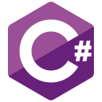
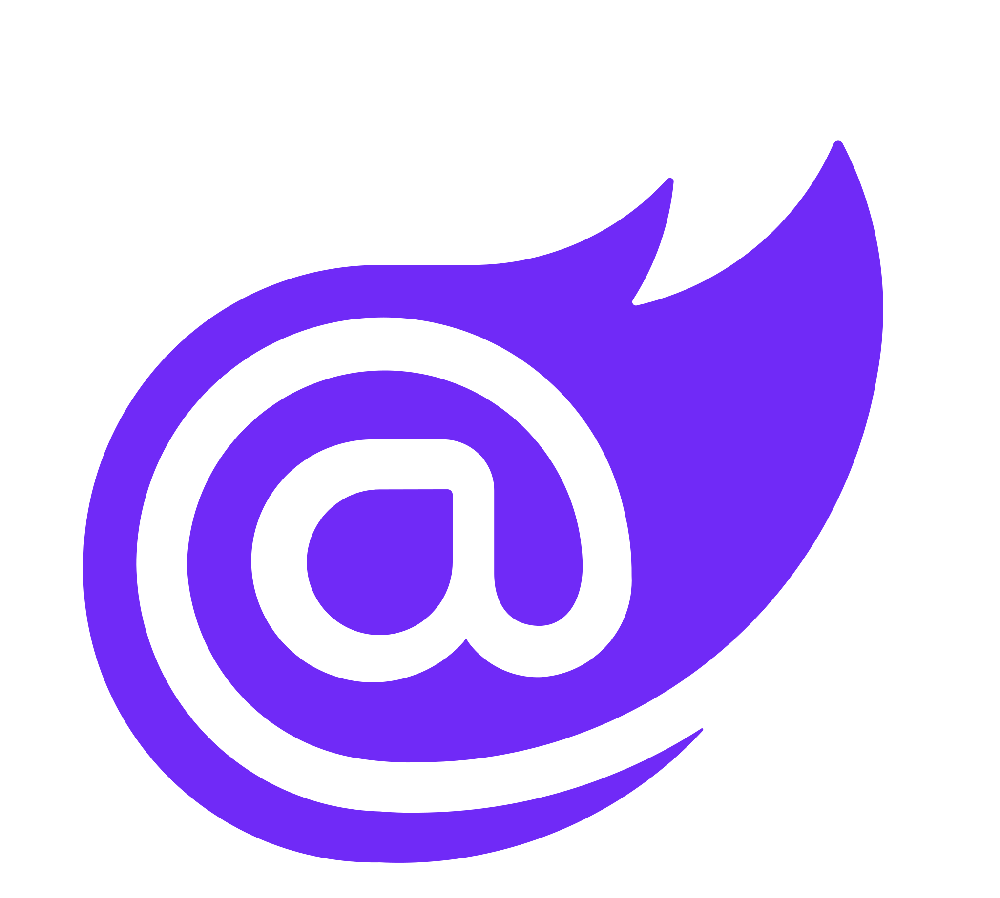

<h1 align="center">  </h1> 
  <!-- TODO: replace with the Vercel URL once the portfolio is deployed -->  
 <h2 align="center">About me</h2> 
 🛡️ Software Developer with <b>4 years of .NET and React</b> experience, transitioning into <b>application security and penetration testing</b>.  🔧 Currently remediating vulnerabilities from penetration tests directly in code and driving <b>SAST/DAST</b> adoption in CI/CD pipelines.  🎯 Building my offensive security skills through hands-on labs · Open to AppSec and junior pentesting roles.  📍 Argentina · 🌐 Spanish (native), English (upper intermediate) 
   <h3 align="center">Application Security</h3> 
       
 <h3 align="center">Penetration Testing & Security Tools</h3> 
              
 <h3 align="center">Authentication</h3> 
    
 <h3 align="center">Development</h3> 
 <code></code> <code></code> <code></code> <code></code> <code></code> <code></code> <code></code> 
 
      
   <h2 align="center">Hands-on security</h2>
Offensive security labs: scanning and enumeration, web exploitation, privilege escalation, password attacks and pivoting on Windows and Linux targets.
Team penetration test (academic): full engagement against a fictitious company, from recon to executive and technical reporting.
bugbounty-ops: how I organize my bug bounty research while I learn. Checklists per vulnerability class based on OWASP WSTG, recon scripts (subfinder, httpx, nuclei) and a report template. It's a methodology, not a list of findings.

 Full experience, certifications and education in my <a href="https://mquerejeta.vercel.app">portfolio</a> and <a href="https://www.linkedin.com/in/mquerejeta/">LinkedIn</a>. 

